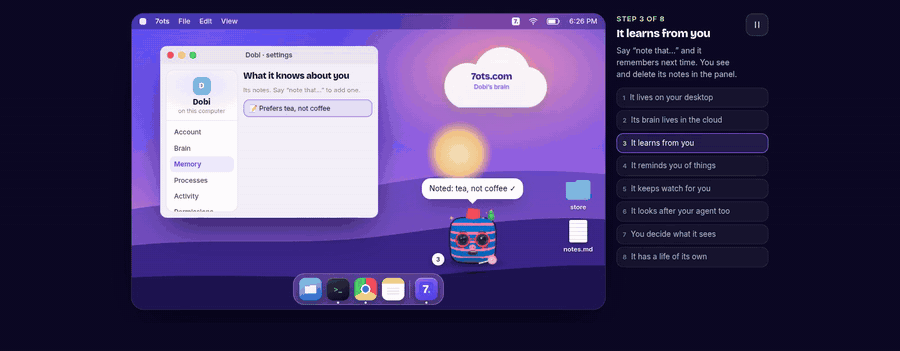
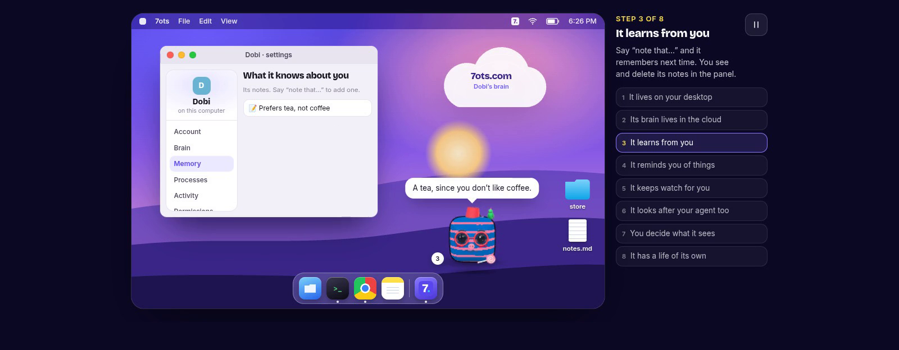

<p align="center"></p>

<p align="center"><b>An AI companion with its own face, living on your desktop.</b></p>

<p align="center">
  <a href="https://github.com/7ots/pet-releases/releases/latest/download/7ots-mac.dmg"></a>
  <a href="https://github.com/7ots/pet-releases/releases/latest/download/7ots-windows.exe"></a>
  <a href="https://github.com/7ots/pet-releases/releases/latest/download/7ots-linux.AppImage"></a>
  <a href="https://github.com/7ots/pet-releases/releases/latest/download/7ots-linux.deb"></a>
</p>

<p align="center">
  <a href="https://www.npmjs.com/package/@7ots/cli"></a>
  <a href="LICENSE"></a>
  <a href="https://github.com/7ots/pet-releases/releases"></a>
</p>

<p align="center">
  <a href="https://7ots.com/site/pet/"></a><br>
  <sub><a href="https://7ots.com/site/pet/">Try the interactive demo</a> · <a href="https://7ots.com">7ots.com</a></sub>
</p>

---

An **ot** is a small character with a face, a personality and a voice. It lives in a transparent window on top of
your desktop, walks around, talks to you in speech bubbles, and helps with the small things: reminders, notes,
keeping an eye on prices or long-running jobs, and telling you when your AI coding agent finishes or needs you.

This repository is the full source of what you install: the desktop app, the `7ots` command-line tool and the
local server they run. It is published so you can read exactly what runs on your computer.

## See it in action

https://github.com/user-attachments/assets/2c23cc1b-9454-4e98-bad5-c98999713b9b

<details>
<summary><b>Full desktop walkthrough</b> (2 min, no sound): the eight things it does, one by one</summary>

https://github.com/user-attachments/assets/a4fd3baf-b76d-4030-87db-aa13e43d505e

</details>

## What it does

| | |
|---|---|
| 🧠 **Thinks in the cloud** | Its brain lives at 7ots.com, so it remembers the same things on every computer. You can switch it to a local AI CLI or your own API key. |
| ⏰ **Reminds you** | “Remind me to stretch in 10 minutes.” It pops up when it's time, and you can see every pending reminder in its panel. |
| 📝 **Learns from you** | Say “note that I prefer tea” and it remembers next time. Notes live in a panel where you can read and delete them. |
| 👀 **Keeps watch** | Prices, processes, builds: “tell me when BTC crosses 85k” and get on with your day. |
| 🤖 **Looks after your agent** | Hooks for Claude Code and your shell: it tells you when a task finishes, fails or asks for permission. |
| 🔒 **You decide what it sees** | Screen awareness is off by default. Everything it can access is a switch in its settings. |

<p align="center"></p>

## Install

**Desktop app (recommended).** Download the installer for your system with the buttons above, open it, and your
ot appears on the desktop. To link it to your 7ots.com account, open its panel → **Account** → **Connect with
7ots.com** and pick your ot. The app updates itself from [`7ots/pet-releases`](https://github.com/7ots/pet-releases).

**Command line** (Node.js 20 or newer):

```sh
npx @7ots/cli pet                     # your ot moves to your desktop
npx @7ots/cli hooks install --claude  # and starts listening to Claude Code
```

<details>
<summary>All CLI commands</summary>

```text
7ots new [--seed s] [--name n] [--lang en|es|pt] [--global]   create a random identity
7ots setup                                 wizard: where it lives, brain, voice, pet, hooks
7ots pet [--mode desktop|terminal|browser|auto] [--detach]    wake up your pet
7ots pet --tmux                            the terminal pet in a tmux side pane
7ots feed | play | sleep | wake | say <text> | stop
7ots ask <text>                            "remind me to check email in 10 min", "remember that…"
7ots reminders [--cancel <id>]             pending reminders and what it remembers
7ots config                                settings page: brain, what it can see, notes
7ots hooks install|remove [--claude] [--shell] [--global]
7ots status [--line|--json]                pet state (--line: one line for tmux)
7ots docs                                  everything for coding agents (same as 7ots.com/llms.txt)
```

Identities are reproducible: the same seed gives the same ot everywhere.
</details>

**Let your coding agent do it.** Paste this into Claude Code, Codex or Cursor:

> Install my 7ots ot as a desktop pet. First read https://7ots.com/llms.txt, then wake it up with
> `npx -y @7ots/cli pet --detach` and connect it to this agent with `npx -y @7ots/cli hooks install --claude`.

## Build from source

```sh
npm ci && npm run build        # the CLI, the pet and its web assets (dist/)
npm run check                  # syntax check of every source file
node cli/7ots.mjs pet          # run the pet straight from the checkout

cd desktop && npm ci
npm run dist:linux             # or dist:mac / dist:win → desktop/release/
```

The installers on the releases page are built by CI from this same code, one tag per release.

## How it's put together

```text
cli/        the 7ots command and the pet: window, speech bubbles, settings panel (cli/pet/)
desktop/    the Electron app that packages the pet with its own runtime (no Node needed)
server/     the local server the pet and the CLI talk to
src/        the character: face generator, animations, voice
skills/     what the ot knows how to do, as plain files
brand/      logo, colors and the ot's look
```

[`README.es.md`](README.es.md) has the long-form guide in Spanish, including the embeddable web SDK and its API.

## Privacy and security

- Screen awareness is **off** by default. Turning it on, and everything else it can see, is in **Settings**.
- Notes and reminders are listed in its panel, where you can read and delete each one.
- Found a vulnerability? Please follow [SECURITY.md](SECURITY.md) instead of opening a public issue.

## Contributing

Issues and pull requests are welcome. See [CONTRIBUTING.md](CONTRIBUTING.md).

## License

[MIT](LICENSE) © 7ots
